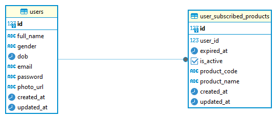

# Kenalan-User
User Service of Kenalan

# Design
- 
- 

# DDL

CREATE TABLE public.users (
	id serial8 NOT NULL,
	full_name varchar(255) NOT NULL,
	gender varchar(10) NOT NULL,
	dob timestamp NOT NULL,
	email varchar(255) NOT NULL,
	"password" varchar(255) NOT NULL,
	photo_url text NOT NULL,
	created_at timestamp NOT NULL,
	updated_at timestamp DEFAULT now() NOT NULL,
	CONSTRAINT users_pk PRIMARY KEY (id),
	CONSTRAINT users_unique UNIQUE (email)
);

CREATE TABLE public.user_subscribed_products (
	id serial8 NOT NULL,
	user_id int8 NOT NULL,
	expired_at timestamp NOT NULL,
	is_active boolean NOT NULL,
	product_code varchar(255) NOT NULL,
	product_name varchar(255) NOT NULL,
	created_at timestamp NOT NULL,
	updated_at timestamp DEFAULT now() NOT NULL,
	CONSTRAINT subscribed_products_pk PRIMARY KEY (id),
	CONSTRAINT subscribed_products_users_fk FOREIGN KEY (user_id) REFERENCES public.users(id)
);

# How to run
- checkout this repo
- go run main.go